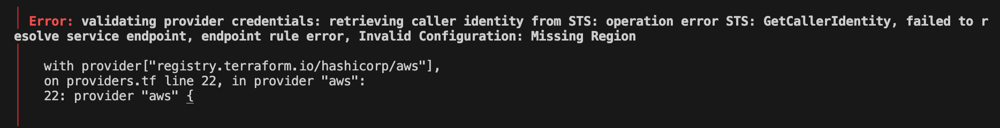
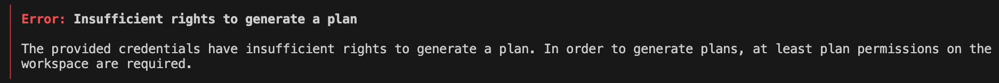
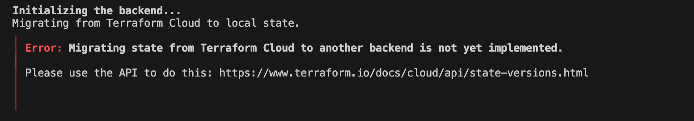
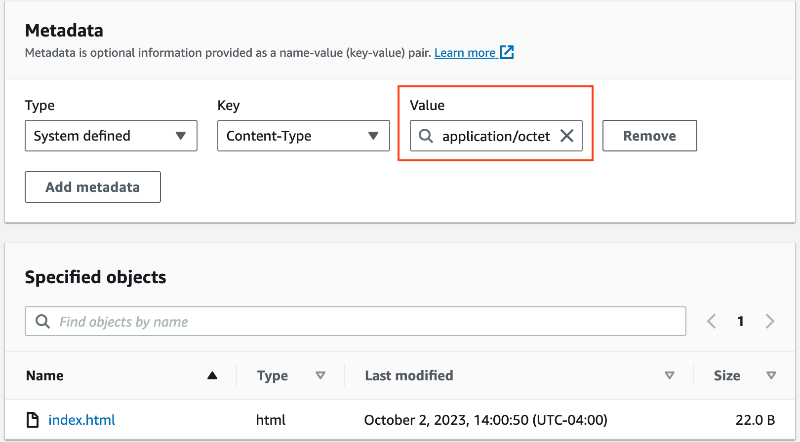
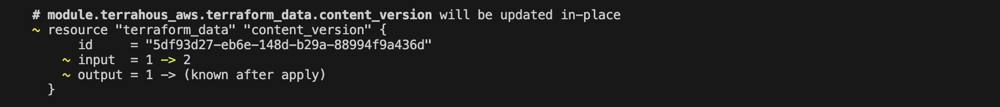

# Terraform Beginner Bootcamp 2023 - Week 1

### Table of contents(TOC)


## 1. Root Module Structure
Our root module structure is as follows:

```
<root_module>/
├── README.md                # Describes the Terraform module/configuration and its usage.
├── main.tf                  # Contains the primary set of Terraform resources and configurations.
├── variables.tf             # Declares variables for customizing the Terraform configuration.
├── outputs.tf               # Defines values to output after provisioning infrastructure(like, bucket name, arn, etc).
├── providers.tf             # Configures the providers (e.g., AWS, Azure, GCP) Terraform uses.
├── terraform.tfvars         # Sets default or specific values for the declared variables.
```

### 1.1 Errors that you might run into!!!
1. While running terraform plan, you might run into following error:


    

    Our terraform state is stored in Terraform Cloud, but it doesn't have AWS Access & Secret access keys stored as environment variables to interact with AWS API. 

    Therefore, to fix above error:  
    - Go to Terraform Cloud UI
    - Select the workspace
    - Click on variables and add AWS keys as env variables, mark it as sensitive.
    - run `terraform plan` again

    
 
2. While running terraform plan, the other error you may encounter is as follows: 

    

Above error mostly arises because of the incorrect/expired token or sometimes if the token is generated at the wrong place

In this case, I encountered the above error because I generated the 'Organizational Token', which is used to manage teams, team membership and workspaces. This **token does not have permission to perform plans** and applies in workspaces.

Correct way to create the user token:
- Click on user profile icon
- Click on `User Settings` --> Click on tokens
- Create New API Token


## 2. Talk about variables, kind of variables, how to pass those(loading of tf veraibles) and what's the order of prescedence of variables in terraform

### 2.1 Types of variables

There are two kind of variables in terraform:

- **Terrform variables**:    These variables should match the declarations in your configuration, like in variables.tf

- **Environment variables**: These variables are available in the Terraform runtime environment.

### 2.2 Passing variables to TF plan

Variables can either be picked up from default value defined for variables in `variables.tf` file or from `terrform.tfvars` file.

Providing a value for a variable in the terraform.tfvars file is not mandatory if we have already defined a default value for that variable.

In addition to the terraform.tfvars file, you can assign a value to a variable using the -var option when executing the terraform plan command.

```
terraform plan -var "user_uuid=aaaaaaa-bbbb-cccc-dddd-330eeeeeeeee"
```

### 2.3 Terraform varibales `Order Of Precedence`

```
High Priority
     ^                     
     |
     |        command line (-var & -var-file)
     |                       ^
     |                       |
     |                  .auto.tfvars
     |                       ^
     |                       |
     |              terraform.tfvars file
     |                       ^
     |                       |
     |                    env vars
     |                       ^
     |                       |
     |                    defaults
Low Priority

```
### 2.4 Migrating the state from cloud to local again
 In order to migrate the state back from Terraform Cloud to local again, comment out the following section in `providers.tf` file along with the `init` command

 ```tf
 cloud {
    organization = "tfbootcamp-2023"

    workspaces {
      name = "terrahouse-1"
    }
  }
 ```
, and run
```tf
terraform init
```
But, you may run into below error:


  

  To fix this, delete `.terraform.lock.hcl` file and `.terraform` directory and run `terrform init` again.

  ###### 2.5 Is whatever we did above in Migrating the state from cloud to local again the correct way? --> `TODO`

  ## 3. Dealing with Configuration drift

  ### 3.1 What happens when you lost your terraform state file
When you lose your Terraform state file:

  - It leads to **Loss of Mapping**. Terraform will have no knowledge of the resources it has managed. This disconnect means that Terraform can't manage, modify, or destroy the previously created resources based on your configurations.

  - If you try to run terraform apply during this time, Terraform will likely attempt to create new instances of all resources defined in your configurations, leading to potential resource conflicts or duplications, which is not **BEARABLE** **in** **PRODUCTION**.

  **Solution**:

- **Terraform Import**: Use the terraform import command to reassociate each resource in your configuration with its real-world instance. This manual process can be tedious for large infrastructures.
- **Backup Strategy**: Always back up your state files, especially if stored locally. For production workloads, consider using remote state storage solutions like Terraform Cloud, AWS S3, or other backends that allow versioning and backup capabilities.

In this bootcamp, we purposly deleted the `terraform.tfstate` file and then tried to bring back previously existing stage by importing the resources.

**Note**: `Some resources simply could not be imported back into state, like random_string. It will lead to recreation of existing resources which is not possible sometimes.

We are removing random_string resources in this section as using might not be best use case for future sections.

### 3.2 Fix missing resources with terraform import
If certain resources are missing from the state file but exist in the real-world environment, you can use the terraform import command:

```
# Importing random string
terraform import random_string.bucket_name kj6aabzpfzte3mk226o5tdjioko37if1

# Import S3 bucket
terraform import aws_s3_bucket.example kj6aabzpfzte3mk226o5tdjioko37if1
```

Checkout he docs for [Random string import](https://registry.terraform.io/providers/hashicorp/random/latest/docs/resources/string#import) and [S3 buckket import](https://registry.terraform.io/providers/hashicorp/aws/latest/docs/resources/s3_bucket#import)

### 3.3 Manual configuration
Any manual changes made to the infra managed by terraform are usually detected by terrafor plan.

Educate teams on Terraform-first changes, restrict infrastructure modification access, utilize monitoring for change alerts, run frequent terraform plan for drift detection, and enforce standards using tools like Sentinel in Terraform Cloud/Enterprise.

## 4. Terraform Modules

### 4.1 Terraform Module Structure
A Terraform module is a set of Terraform configuration files in a single directory. 

Sample terraform module structure is shown below:

```tf
$ tree modules/terrahouse_aws
.
├── README.md
├── main.tf
├── variables.tf
├── outputs.tf
```

### 4.2 Passing Input Variables 
- Initially, you must declare the variables you intend to provide values for within the child module. This can be accomplished by creating a [variables.tf](/modules/terrahous_aws/variables.tf) file within the [child module's](/modules/terrahous_aws) directory. Here's an example:

```tf
  variable "user_uuid" {
  type        = string
  description = "The Terraform BootCamp UUID"

  validation {
    condition     = length(var.user_uuid) > 5
    error_message = "User UUID provided is not VALID, please check!!!"
  }
}


variable "bucket_name" {
  description = "The name of the S3 bucket, should be all lowercase."
  type        = string
  validation {
    condition     = !can(regex("[A-Z]", var.bucket_name))
    error_message = "The bucket_name must not contain uppercase letters."
  }
}
```

- Next, you should use these variables within the child module wherever they are required. For example, if you're creating an AWS S3 bucket, you might implement it like this:

  ```tf
  resource "aws_s3_bucket" "website_bucket" {
  bucket = var.bucket_name

  tags = {
    UserUUID = var.user_uuid
    managedBy = "terraform"
  }
  }
  ```

- Lastly, when invoking the child module from the parent module, you have the ability to supply values to these variables. This is achieved in the following manner:

  ```
  module "terrahous_aws" {
    source = "./modules/terrahous_aws"
    user_uuid = var.user_uuid
    bucket_name = var.bucket_name
    } 
  ```


### 4.3 Modules Sources
Modules can be sourced from a variety of locations. Some common sources are:

- Local paths
- GitHub
- Terraform Registry
- S3 buckets

## 5. S3 Static Website Hosting
You can use Amazon S3 to host a static website. On a static website, individual webpages include static content. 

### 5.1 Path Variable and example
In Terraform, the path module provides functions to interact with filesystem paths. This can be  useful when referencing files relative to your Terraform configuration or module.

Functions provided by the path module include:

- **path.cwd**: is the filesystem path of the original working directory from where you ran Terraform before applying any -chdir argument. 

- **path.module** is the filesystem path of the module where the expression is placed. **NOT RECOMMENDED**

- **path.root** is the filesystem path of the root module of the configuration.

For more details about the terraform path variables, please checkout [Filesystem & Workspace info](https://developer.hashicorp.com/terraform/language/expressions/references#path-module) documentation.

You can use the `terraform console` command to evaluate expressions and test out Terraform's built-in functions.

```tf
$ terrform console

> path.module
"."

> path.root
"."

> path.cwd
"/workspace/terraform-beginner-bootcamp-2023"
```

You can also use a combination of functions. For example, you can concatenate the result of the abspath function (which gives the absolute path of a given relative path) with path.root or path.module.

```tf
$ terrform console

> abspath(path.module)
"/workspace/terraform-beginner-bootcamp-2023"

> abspath(path.root)
"/workspace/terraform-beginner-bootcamp-2023"
```

### 5.2 Filexit and filemd5 function

[**fileexists**](https://developer.hashicorp.com/terraform/language/functions/fileexists) determines whether a file exists at a given path.

```tf
fileexists(path)
```

Example from our code:
```tf
variable "error_html_filepath" {
  description = "The path of the file to check."
  type        = string

  validation {
    condition     = fileexists(var.error_html_filepath)
    error_message = "The error.html file does not exist."
  }
}
```

Above is checking whether the varible `error_html_filepath` or `index_html_filepath` exists or not.

[**filemd5**](https://developer.hashicorp.com/terraform/language/functions/filemd5) is a variant of md5 that hashes the contents of a given file rather than a literal string.

### 5.3 Etag

We are using etag to know when the file or value changes, basically we are using this in our code to know when the contents of files index.html or error.html changes, it will change the etag value corresponding to it and will try to upload the file again.

**Doc**: https://registry.terraform.io/providers/hashicorp/aws/latest/docs/resources/s3_object#etag

Example from our code:
```tf
resource "aws_s3_object" "error_html_object" {
  bucket = aws_s3_bucket.website_bucket.bucket
  key    = "error.html"
  source = var.error_html_filepath
  etag = filemd5(var.error_html_filepath)
}
```
Other Terraform functions can be accessed at: https://developer.hashicorp.com/terraform/language/functions

## 6. Terraform CloudFront Distribution

[**Amazon CloudFront**](https://aws.amazon.com/cloudfront/?nc=sn&loc=1) is a [**content delivery network (CDN)**](https://aws.amazon.com/what-is/cdn/) provided by Amazon Web Services. By using a CDN, companies can accelerate delivery of files to users over the Internet while also reducing the load on their own infrastructure. 

### 6.1 Terraform Locals
[**Terraform Locals**](https://spacelift.io/blog/terraform-locals) are [named values](https://developer.hashicorp.com/terraform/tutorials/configuration-language/locals?utm_source=WEBSITE&utm_medium=WEB_IO&utm_offer=ARTICLE_PAGE&utm_content=DOCS) which can be assigned and used in your code. It mainly serves the purpose of reducing duplication within the Terraform code.

Example:

```tf
locals {
  s3_origin_id = "terrahouse-S3Origin"
}
```

### 6.2 Terraform Data Sources
[**Data sources**](https://developer.hashicorp.com/terraform/language/data-sources) allow Terraform to use information defined outside of Terraform, defined by another separate Terraform configuration, or modified by functions.

Example:
```tf
## Use this data source to get the access to the effective Account ID, User ID, and ARN

data "aws_caller_identity" "current" {}
```


### 6.3 Working with json in Terraform 
The [**jsonencode function**](https://developer.hashicorp.com/terraform/language/functions/jsonencode) in Terraform provides a way to convert standard HCL types (like maps, lists, strings, numbers, and bools) into their JSON representation.

`jsonencode`` can be used with AWS S3 bucket policies because these policies are written in JSON.

Example:
```tf
policy = jsonencode(
    {
        "Version"= "2008-10-17",
        "Id"= "PolicyForCloudFrontPrivateContent",
        "Statement"= [
            {
                "Sid"= "AllowCloudFrontServicePrincipal",
                "Effect"= "Allow",
                "Principal"= {
                    "Service"= "cloudfront.amazonaws.com"
                },
                "Action"= "s3:GetObject",
                "Resource"= "arn:aws:s3:::${var.bucket_name}/*",
                "Condition"= {
                    "StringEquals"= {
                      "AWS:SourceArn"= "arn:aws:cloudfront::${data.aws_caller_identity.current.account_id}:distribution/${aws_cloudfront_distribution.terrahouse_distribution.id}"
                    }
                }
            }
        ]
    }
  )
```

### 6.4 Problem that you may encounter...!

At this point, our code is up and running, and we've successfully deployed the CloudFront Distribution. It can access objects in the S3 bucket without requiring public access to be enabled.

BUT, what is the problem here?

The issue arises when we attempt to access the `cloudfront_distribution_domain_name` through a browser. Instead of displaying the content directly in the browser, it downloads the `index.html` file from our S3 bucket.

The root cause lies in the fact that when we upload files like `index.html` or `error.html` in the [resource-storage.tf](/workspace/terraform-beginner-bootcamp-2023/modules/terrahous_aws/resource-storage.tf), S3 assigns a default content type of `application/octet` to these uploaded files. You can check it metadata of the uploaded files





What we would prefer is for the browser to recognize our HTML files as such. To achieve this, we need the browser to receive the correct MIME type (e.g., text/html, text/css, image/png) in the Content-Type header. The eay way to accomplish this is by specifying the correct content type when uploading these files.

```tf
resource "aws_s3_object" "error_html_object" {
  bucket = aws_s3_bucket.website_bucket.bucket
  key    = "error.html"
  content_type = "text/html"  #<-- Add this
  source = var.error_html_filepath
  etag = filemd5(var.error_html_filepath)
}
```

## 7. Terraform Data and Content Version

### 7.1 Terraform Data 
`terraform_data` is a new resource that gets introduced in v1.4 as a replacement for `null_resource`.

Unlike `null_resource`, you don't need extra provider for `terraform_data`

The purpose of `terraform_data` is similar to `null_resource`: 
- It does not interact with any external systems. It's a generic resource that has no behaviors attached and is often used to react to changes in other resources. 

- It can serve as a "hook" to trigger certain provisioners when other real resources change.

**Example from our code:**
```tf
resource "terraform_data" "content_version" {
  input = var.content_version
}
```

### 7.2 Changing the lifecycle of resources
In Terraform, the [**lifecycle meta-argument**](https://developer.hashicorp.com/terraform/language/meta-arguments/lifecycle#replace_triggered_by) provides controls that allow you to customize or override the default behavior of resource updates, creations, and deletions.

Lifecycle Attributes:

- **create_before_destroy**: Creates a new resource first, then destroys the old, minimizing downtime during updates.

- **prevent_destroy**: Prohibits Terraform from destroying the specified resource, erroring if attempted.

- **ignore_changes**: Ignores specified attribute changes, preventing them from triggering resource updates.

**Example from our code:**
```tf
resource "aws_s3_object" "error_html_object" {
  bucket = aws_s3_bucket.website_bucket.bucket
  key    = "error.html"
  content_type = "text/html"
  source = var.error_html_filepath
  etag = filemd5(var.error_html_filepath)

  lifecycle {
    replace_triggered_by = [terraform_data.content_version.output]
    ignore_changes = [etag]
  }
}
```

Whenever the contents in the file changes, its corresponding etag also change. In this section, we need to only upload the files when the `content_version` is changed.

In the above **lifecycle block**, we are ignoring any changes made to etag, which means `terraform plan` shouldn't output any changes in the plan when etag gets modified. 

Above lifecycle block will only update the html files to S3 bucket when there is a change in the content_version. So, the approach should when you attempt to update the html files, you should also update the variable value.




## 8. Invalidate Cache using provisioners

When we trigger a **cache invalidation**, for certain files `.html` in CloudFront, we remove them from the CloudFront edge caches before their scheduled expiration. This process guarantees that CloudFront fetches the most up-to-date versions of the `.html` files from our origin.

In this instance, we're once again utilizing the `terraform_data` resource, which functions as a trigger. It prompts the local provisioner to execute AWS CLI command to invalidate the cache whenever there's a modification in the content_version.

```tf
resource "terraform_data" "invalidating_cache" {
  triggers_replace = [
    terraform_data.content_version.output
  ]

  provisioner "local-exec" {
    command = <<EOT
aws cloudfront create-invalidation \
--distribution-id ${aws_cloudfront_distribution.terrahouse_distribution.id} \
--paths '/*'
   EOT

  }
}
```
Refer [**heredoc-strings**](https://developer.hashicorp.com/terraform/language/expressions/strings#heredoc-strings) document to know more about strings & literal expressions in Terraform.

### 8.1 Provisioners

Provisioners are used as a to execute scripts or actions during specific lifecycle moments of a resource. They can help in tasks like bootstrapping, software installation, or configuration.

As per terraform [**provisioners**](https://developer.hashicorp.com/terraform/language/resources/provisioners/syntax) documentation, it should always be used as the Last Resort. All examples are provided in the provisioners doc

Types of provisioners:

- **local-exec**: This runs a command locally on the machine executing the Terraform code. It can be used to run a local script when a resource changes.

  **Use case:** Running a cleanup script on your local machine when a resource is destroyed.

  Example from our code:

  ```tf
    provisioner "local-exec" {
      command = <<EOT
      aws cloudfront create-invalidation \
      --distribution-id ${aws_cloudfront_distribution.terrahouse_distribution.id} \
      --paths '/*'
   EOT

  }
  ```

- **remote-exec**: This runs a command on a remote resource using SSH or WinRM. It's typically used to bootstrap a freshly-created VM.

  **Use case:** Installing software or upldates on a new EC2 instance right after it's created.

  Example:
  ```tf
  provisioner "remote-exec" {
    inline = [
      "chmod +x /tmp/script.sh",
      "/tmp/script.sh args",
    ]
  }
  ```

- **file Provisioner**: This is used for copying files or directories from the machine executing Terraform to the new resource or vice versa.

  Example:
  ```tf
  # Copies the myapp.conf file to /etc/myapp.conf

  provisioner "file" {
    source      = "conf/myapp.conf"
    destination = "/etc/myapp.conf"
  }
  ```