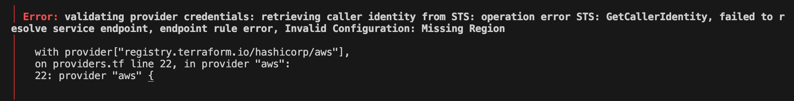
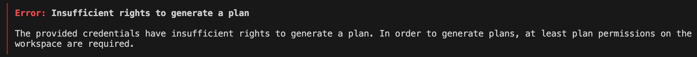
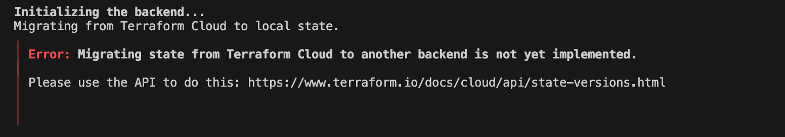

# Terraform Beginner Bootcamp 2023 - Week 1

### Table of contents(TOC)


## 1. Root Module Structure
Our root module structure is as follows:

```
<root_module>/
├── README.md                # Describes the Terraform module/configuration and its usage.
├── main.tf                  # Contains the primary set of Terraform resources and configurations.
├── variables.tf             # Declares variables for customizing the Terraform configuration.
├── outputs.tf               # Defines values to output after provisioning infrastructure(like, bucket name, arn, etc).
├── providers.tf             # Configures the providers (e.g., AWS, Azure, GCP) Terraform uses.
├── terraform.tfvars         # Sets default or specific values for the declared variables.
```

### 1.1 Errors that you might run into!!!
1. While running terraform plan, you might run into following error:


    

    Our terraform state is stored in Terraform Cloud, but it doesn't have AWS Access & Secret access keys stored as environment variables to interact with AWS API. 

    Therefore, to fix above error:  
    - Go to Terraform Cloud UI
    - Select the workspace
    - Click on variables and add AWS keys as env variables, mark it as sensitive.
    - run `terraform plan` again

    
 
2. While running terraform plan, the other error you may encounter is as follows: 

    

Above error mostly arises because of the incorrect/expired token or sometimes if the token is generated at the wrong place

In this case, I encountered the above error because I generated the 'Organizational Token', which is used to manage teams, team membership and workspaces. This **token does not have permission to perform plans** and applies in workspaces.

Correct way to create the user token:
- Click on user profile icon
- Click on `User Settings` --> Click on tokens
- Create New API Token


## 2. Talk about variables, kind of variables, how to pass those(loading of tf veraibles) and what's the order of prescedence of variables in terraform

### 2.1 Types of variables

There are two kind of variables in terraform:

- **Terrform variables**:    These variables should match the declarations in your configuration, like in variables.tf

- **Environment variables**: These variables are available in the Terraform runtime environment.

### 2.2 Passing variables to TF plan

Variables can either be picked up from default value defined for variables in `variables.tf` file or from `terrform.tfvars` file.

Providing a value for a variable in the terraform.tfvars file is not mandatory if we have already defined a default value for that variable.

In addition to the terraform.tfvars file, you can assign a value to a variable using the -var option when executing the terraform plan command.

```
terraform plan -var "user_uuid=aaaaaaa-bbbb-cccc-dddd-330eeeeeeeee"
```

### 2.3 Terraform varibales `Order Of Precedence`

```
High Priority
     ^                     
     |
     |        command line (-var & -var-file)
     |                       ^
     |                       |
     |                  .auto.tfvars
     |                       ^
     |                       |
     |              terraform.tfvars file
     |                       ^
     |                       |
     |                    env vars
     |                       ^
     |                       |
     |                    defaults
Low Priority

```
### 2.4 Migrating the state from cloud to local again
 In order to migrate the state back from Terraform Cloud to local again, comment out the following section in `providers.tf` file along with the `init` command

 ```tf
 cloud {
    organization = "tfbootcamp-2023"

    workspaces {
      name = "terrahouse-1"
    }
  }
 ```
, and run
```tf
terraform init
```
But, you may run into below error:


  

  To fix this, delete `.terraform.lock.hcl` file and `.terraform` directory and run `terrform init` again.